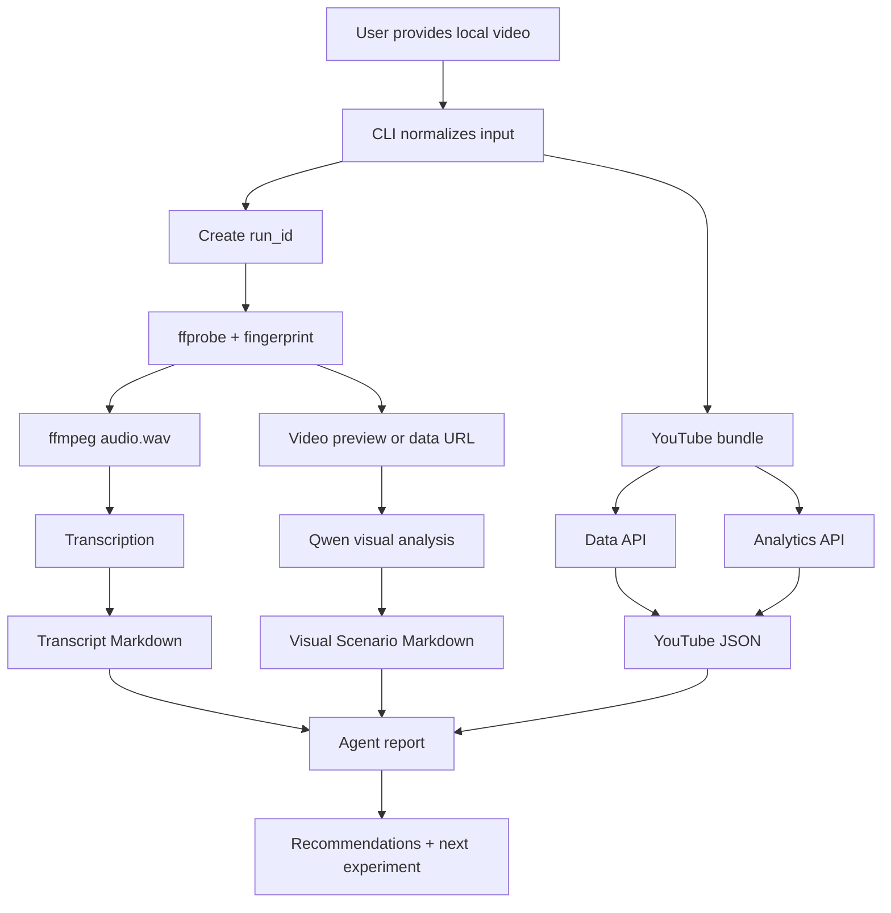

# Video Analytics Memento

> [!abstract]
> Метод Memento - это способ передать новой AI-сессии рабочую память проекта: неизменные факты, смысловые блоки, инструкции, карту связей, источники проверки и правила качества. Файл нужен, чтобы агент продолжал работу осмысленно, а не начинал с нуля.

## 1. Татуировки: неизменные факты

- **Video Analytics** - Node/TypeScript CLI для цепочки `local video -> transcript + visual scenario + YouTube metrics JSON`.
- Проект может использоваться как самостоятельный CLI или как agent skill в папке `skills/video-analyst`.
- Сервис не скачивает YouTube-видео; визуальный анализ всегда требует локальный файл через `--video`.
- Транскрипция и визуальный анализ разделены: аудио обрабатывает `whisper-cli` или `openrouter-stt`, визуальный ряд обрабатывается Qwen через OpenRouter.
- YouTube Data API даёт публичные данные видео, канала, комментариев и captions metadata; YouTube Analytics API даёт приватные метрики только для владельца или авторизованного пользователя.
- Thumbnail CTR не считается поддерживаемой метрикой текущего API-слоя; в отчётах и JSON его нужно помечать как `unsupported_by_youtube_analytics_api`.
- `outputs/` и `.system/` являются локальными рабочими артефактами и не должны попадать в публичный репозиторий без санации.
- `.env`, OAuth tokens, реальные входные manifest-файлы, raw media, outputs и `.system/run_*` должны оставаться вне Git.
- Визуальный анализ отправляет видео или сжатый preview во внешний OpenRouter/Qwen; для чувствительных видео нужен явный privacy review.
- Финальный аналитический отчёт пока пишет агент по `SKILL.md`; отдельной CLI-команды report generator в проекте нет.
- `README.md` является human-facing quick start, а `SKILL.md` - agent-facing workflow.
- Перед утверждением изменений нужно запускать `npm test`.

## 2. Полароиды: смысловые блоки системы

### P1. CLI и входные данные

**Статус:** active - одиночный запуск и batch manifest реализованы.

CLI принимает локальный путь к видео, optional YouTube URL/ID, optional title и JSONL manifest. YouTube ID извлекается из raw ID, `youtu.be`, `youtube.com/watch?v=` и `youtube.com/shorts/`.

**Зачем нужно:** дать человеку и агенту один стабильный вход без UI, базы данных и ручной сборки артефактов.

**Ключевые правила:** локальный `--video` нужен для visual analysis; без YouTube ID YouTube sections должны быть skipped; title может прийти из CLI, manifest, YouTube metadata или имени файла.

**Типовые ошибки:** передать только YouTube URL и ожидать скачивания; использовать placeholder вместо реального ID в live run; забыть, что batch manifest может содержать приватные абсолютные пути.

**Как проверять:** `npm run analyze -- --video ./fixtures/sample.mp4 --youtube-id VIDEO_ID` должен завершиться без ручной правки JSON.

**Вход:** CLI args или `inputs/videos.jsonl`.  
**Выход:** `outputs/<stem>/...` и `.system/<run_id>/...`.

### P2. Конфигурация, секреты и приватность

**Статус:** active - `.env.example`, `.gitignore` и README safety notes существуют.

Конфигурация читается из `.env` и process env. Основные переменные: `OPENROUTER_API_KEY`, `YOUTUBE_API_KEY`, `GOOGLE_OAUTH_CLIENT_ID`, `GOOGLE_OAUTH_CLIENT_SECRET`, `VIDEO_ANALYTICS_*`, `YOUTUBE_OAUTH_TOKEN_PATH`.

**Зачем нужно:** отделить код от ключей, OAuth tokens, локальных моделей и приватных output-артефактов.

**Ключевые правила:** не печатать `.env`; не цитировать OAuth token; не публиковать реальные `outputs/` и `.system/`; `.env.example` должен содержать только placeholders и переносимые относительные пути.

**Типовые ошибки:** коммитить реальные отчёты, транскрипты, `.system` JSON, локальные manifest-файлы или raw media; оставлять персональные пути в README, tests или defaults.

**Как проверять:** `git status --short`, `git check-ignore`, `git grep` по секретным паттернам и локальным путям.

**Вход:** `.env`, `.env.example`, `.gitignore`.  
**Выход:** безопасный `VideoAnalyticsConfig` и приватные локальные credentials.

### P3. Media runtime, транскрипция и Qwen

**Статус:** active - media pipeline, transcript flow и Qwen visual flow реализованы.

Media layer считает fingerprint, сохраняет ffprobe metadata, извлекает mono 16k `audio.wav`, готовит direct video data URL или compressed preview. Транскрипт сохраняется отдельно от визуального анализа.

**Зачем нужно:** получить воспроизводимый run и не смешивать speech-to-text с visual understanding.

**Ключевые правила:** raw media artifacts хранятся в `.system/<run_id>/`; Qwen request должен логировать redacted data URL; без `OPENROUTER_API_KEY` visual analysis должен быть skipped, а не валить pipeline.

**Типовые ошибки:** считать Qwen заменой ASR; отправить слишком большое видео без preview; использовать OpenRouter-модель без video modality; забыть локальную Whisper-модель.

**Как проверять:** появляются `fingerprint.json`, `ffprobe.json`, `audio.wav`, `transcript.raw.json`, `qwen.request.json`, `qwen.response.json`, transcript Markdown и visual scenario Markdown.

**Вход:** локальный видеофайл.  
**Выход:** transcript artifacts и visual scenario artifacts.

### P4. YouTube Data API и Analytics

**Статус:** active - bundle orchestration, public API, OAuth Analytics, daily rows, retention rows и extra reports реализованы.

`fetchYouTubeBundle` собирает public video data, channel data, latest uploads, comments, captions metadata, Analytics summary, daily rows, retention rows, traffic, geography, devices, demographics, engagement и channel benchmark where available.

**Зачем нужно:** связать локальный разбор видео с фактической статистикой публикации.

**Ключевые правила:** без `YOUTUBE_API_KEY` public sections skipped; без OAuth Analytics sections skipped; чужие видео не дадут private Analytics; no rows не является ошибкой pipeline.

**Типовые ошибки:** ожидать private Analytics для чужого видео; считать captions metadata текстом субтитров; ожидать thumbnail CTR; смешивать public counters и private Analytics без объяснения.

**Как проверять:** `YOUTUBE_<id>.json.statuses` показывает status каждой секции; unit tests покрывают skipped modes и request params.

**Вход:** YouTube ID, API key, optional OAuth token.  
**Выход:** aggregate YouTube JSON и raw `.system/youtube.*.json`.

### P5. Отчёты и интерпретация

**Статус:** active as agent workflow - структура отчёта описана в `SKILL.md`, CLI generator ещё не реализован.

После анализа агент читает transcript, visual scenario, YouTube JSON и run manifest, затем пишет отчёт `outputs/reports/YOUTUBE_REPORT_<id>_<safe-video-title>.md`. Если YouTube ID нет, используется `outputs/reports/YOUTUBE_REPORT_<safe-video-title>.md`.

**Зачем нужно:** превратить raw artifacts в понятный документ с метриками, сценарием, выводами и рекомендациями.

**Ключевые правила:** отчёт должен опираться на реальные данные; retention и comments нельзя выдумывать; эмодзи использовать умеренно в заголовках; title должен быть последней частью имени файла.

**Типовые ошибки:** писать сценарий v2 вместо реального сценария текущего видео; не объяснять missing metrics; делать выводы по CTR; не различать public и private counters.

**Как проверять:** отчёт содержит 12 разделов из `SKILL.md`, включая real scenario table, retention/status, comments/status, recommendations, next experiment и technical status.

**Вход:** `ТРАНСКРИПТ_*.md`, `ВИЗУАЛЬНЫЙ_СЦЕНАРИЙ_*.md`, `YOUTUBE_*.json`, `RUN_*.json`.  
**Выход:** Markdown report, optional PDF generated outside the core CLI.

### P6. Agent-ready и GitHub-ready состояние

**Статус:** active - `SKILL.md` создан, README переведён на английский, публичный репозиторий может использоваться как source.

Проект можно использовать как skill, если папку проекта положить в `skills/video-analyst`, настроить `.env`, установить внешние бинарники и дать агенту прочитать `SKILL.md`.

**Зачем нужно:** другой Codex-агент должен воспроизвести процесс без знания прошлой переписки.

**Ключевые правила:** skill должен объяснять safety, setup, commands, YouTube matching, artifacts, report workflow и validation; публичный repo должен исключать реальные outputs/system artifacts.

**Типовые ошибки:** скопировать только `SKILL.md` без CLI-кода; ожидать отчёт от CLI; забыть настроить external tools; публиковать локальный `Memento.md` до public-sanitization.

**Как проверять:** новая сессия начинает с `Memento.md` и `SKILL.md`, затем запускает `npm test` и может выполнить sample run.

**Вход:** папка проекта.  
**Выход:** переносимый `video-analyst` skill + локальный CLI.

## 3. Бумажки: алгоритмы и инструкции

### B1. Проанализируй одно локальное видео

**Когда использовать:** есть локальный файл и известный или предполагаемый YouTube ID.

**Входные данные:** путь к видео, optional YouTube URL/ID, optional title, настроенный `.env`.

**Шаги:**

1. Проверь, что файл существует и читается.
2. Если YouTube ID неизвестен, выполни B2.
3. Запусти:
   ```bash
   npm run analyze -- --video "/path/to/video.mov" --youtube-id VIDEO_ID --title "Video title"
   ```
4. Дождись завершения `ffmpeg`, Whisper/OpenRouter STT, Qwen и YouTube requests.
5. Открой `outputs/<stem>/RUN_<run_id>.json`.
6. Сверь statuses transcript, visual analysis, YouTube Data API и Analytics.

**Контрольные точки:** появились transcript Markdown, visual scenario Markdown, YouTube JSON, run manifest и `.system/<run_id>/` raw artifacts.

**При ошибках:** проверь `.env`, external tools, Whisper model path, YouTube ID, OpenRouter model support, OAuth rights и API quota.

**Финальный результат:** полный набор артефактов для одного видео.

### B2. Сопоставь локальное видео с YouTube

**Когда использовать:** пользователь дал локальное видео, но не дал точный YouTube ID.

**Входные данные:** локальное видео, optional title hints, доступ к YouTube Data API.

**Шаги:**

1. Проверь длительность через `ffprobe`.
2. Найди кандидатов по названию, теме, длительности и дате публикации.
3. Если совпадение неочевидно, запусти анализ без YouTube ID.
4. Прочитай transcript и найди уникальные фразы.
5. Повтори поиск по фразам и сверяй duration/title.
6. Если остаётся несколько кандидатов, спроси пользователя, не угадывай.

**Контрольные точки:** найден один правдоподобный YouTube ID или явно зафиксирована неоднозначность.

**При ошибках:** без API key попроси URL/ID у пользователя; при no results не подставляй случайный ролик.

**Финальный результат:** verified YouTube ID для полного анализа.

### B3. Сформируй итоговый отчёт

**Когда использовать:** `npm run analyze` уже создал transcript, visual scenario, YouTube JSON и run manifest.

**Входные данные:** `outputs/<stem>/...`, `.system/<run_id>/...`.

**Шаги:**

1. Прочитай transcript Markdown.
2. Прочитай visual scenario Markdown.
3. Прочитай `YOUTUBE_<id>.json`.
4. Выпиши public stats, Analytics summary, daily rows, retention rows/status, comments/status.
5. Разбери реальный сценарий текущего видео по таймкодам.
6. Сформируй выводы: почему сработало, что мешает росту, какие сигналы есть в комментариях.
7. Напиши рекомендации и next-video experiment.
8. Сохрани отчёт в `outputs/reports/YOUTUBE_REPORT_<id>_<safe-video-title>.md` или `outputs/reports/YOUTUBE_REPORT_<safe-video-title>.md`.
9. Запусти `npm test`.

**Контрольные точки:** отчёт не выдумывает retention/CTR; объясняет missing data; содержит artifact paths.

**При ошибках:** если Analytics no rows, анализируй public stats и доступную summary; если visual scenario skipped, честно укажи status.

**Финальный результат:** человекочитаемый отчёт по публикации.

### B4. Подготовь проект к публичному GitHub

**Когда использовать:** перед commit, push, release или передачей проекта другим людям.

**Входные данные:** рабочая папка проекта.

**Шаги:**

1. Запусти `npm test`.
2. Проверь рабочее дерево:
   ```bash
   git status --short
   ```
3. Проверь ignored/private files:
   ```bash
   git status --short --ignored
   git check-ignore -v .env .system/youtube-oauth-token.json outputs/example
   ```
4. Выполни `git grep` по секретным паттернам и локальным путям.
5. Убедись, что `.env.example`, README, tests и fixtures не содержат персональных данных.
6. Не добавляй ignored-файлы через `git add -f`, кроме явно подготовленных public-safe документов.

**Контрольные точки:** tests pass; no live secrets; no private paths; no real outputs/system artifacts in tracked files.

**При ошибках:** остановись, убери секреты или приватные данные, затем повтори scan.

**Финальный результат:** безопасный publish-кандидат.

### B5. Упакуй как agent skill

**Когда использовать:** нужно перенести сервис в другой Codex/agent environment.

**Входные данные:** папка проекта и `SKILL.md`.

**Шаги:**

1. Скопируй проект в `skills/video-analyst`.
2. Оставь рядом `SKILL.md`, `package.json`, `src/`, `test/`, `README.md`, `.env.example`.
3. Создай локальный `.env` на новой машине.
4. Установи/проверь Node 24+, `ffmpeg`, `ffprobe`, `whisper-cli`, Whisper model.
5. Запусти `npm test`.
6. Попроси агента прочитать `SKILL.md` перед задачей анализа видео.

**Контрольные точки:** skill metadata читается, CLI запускается, тесты проходят.

**При ошибках:** если агент не видит skill, проверь расположение папки и frontmatter `SKILL.md`; если CLI не запускается, проверь Node version и external tools.

**Финальный результат:** переносимый навык `video-analyst`.

## 4. Настенная карта / схема

### Индекс материала

1. Входы: CLI args или JSONL manifest.
2. Локальная обработка: fingerprint, ffprobe, audio extraction, transcript.
3. Визуальный анализ: OpenRouter/Qwen video understanding.
4. YouTube слой: public Data API + private Analytics.
5. Выходы: Markdown/JSON artifacts.
6. Агентский слой: `SKILL.md` и генерация итогового отчёта.
7. Безопасность: ignored private artifacts, secret scan, privacy review.

### Схема директорий и связь с полароидами

```text
video-analyst/
  SKILL.md                    -> P6, B5
  README.md                   -> P1, P2, P6
  Memento.md                  -> public-safe operating memory
  .env.example                -> P2
  .gitignore                  -> P2, P6
  package.json                -> P1
  inputs/videos.example.jsonl -> P1
  fixtures/sample.mp4         -> P1
  src/
    cli.ts                    -> P1
    config.ts                 -> P2
    fs.ts                     -> P3
    runtime.ts                -> P3
    video.ts                  -> P3
    transcription.ts          -> P3
    openrouter.ts             -> P3
    qwen-video.ts             -> P3
    youtube.ts                -> P4
    markdown.ts               -> P5
    pipeline.ts               -> P1-P5
    types.ts                  -> P1-P6
  test/                       -> P1-P6
  outputs/                    -> P5, ignored
  .system/                    -> P3-P5, ignored
```

### Связи и зависимости

- `cli.ts` нормализует ввод и вызывает `pipeline.ts`.
- `pipeline.ts` связывает media, transcript, Qwen, YouTube и output registry.
- `video.ts` и `transcription.ts` зависят от локальных бинарников.
- `qwen-video.ts` зависит от OpenRouter key, video-capable model и privacy review.
- `youtube.ts` зависит от API key для public data и OAuth token для private Analytics.
- `SKILL.md` объясняет агенту как пользоваться CLI и как писать отчёт.
- `Memento.md` не заменяет README или SKILL; он ускоряет новую AI-сессию.

### Где проект сейчас

MVP работает, тестовый fixture присутствует, README переведён на английский, `SKILL.md` описывает agent workflow, публичный репозиторий должен содержать только sanitized source files. Следующий крупный шаг - автоматический report generator или более строгий report/PDF pipeline.

### Блокеры и препятствия

- Нет отдельной CLI-команды для генерации финального отчёта.
- Реальные outputs/system artifacts приватны и не подходят для публикации без санации.
- Для Qwen нужен внешний OpenRouter и privacy approval.
- Для Analytics нужны права владельца видео; retention может отсутствовать.
- Batch-запуски могут упереться в YouTube quota.

### Следующий узел маршрута

1. Решить, нужен ли встроенный `report` command.
2. Добавить sanitized example output, если это безопасно и полезно.
3. Добавить `LICENSE`, если проект публикуется как open-source.
4. Добавить `SECURITY.md` или короткий security section.
5. Проверить перенос в реальную папку `skills/video-analyst` в чистой сессии.

### Места риска и непроверенные зоны

- Внешние API и модели могут изменить формат или доступность; перед важным применением проверять официальные docs.
- OpenRouter/Qwen может вернуть пустой content или reasoning-only ответ; код должен сохранять raw response и graceful status.
- Whisper output format может отличаться между сборками.
- PDF/report rendering сейчас не является частью core CLI и может зависеть от локального окружения.
- Public `Memento.md` должен оставаться sanitized; не добавлять реальные IDs, приватные пути, analytics или transcript excerpts.

### Пройденные этапы / закрытые развилки

- Полароид P3: выбрана отдельная транскрипция вместо попытки заменить ASR визуальной моделью.
- Полароид P4: YouTube downloader не входит в MVP, потому что официальный API не выдаёт MP4 и это создаёт platform-policy risk.
- Полароид P4: thumbnail CTR не обещается, потому что текущий YouTube Analytics API-слой не поддерживает нужную метрику.
- Полароид P5: финальный отчёт оставлен agent layer, потому что структура отчёта ещё развивается.
- Полароид P6: реальные outputs не публикуются, потому что могут содержать приватные транскрипты, analytics, comments, previews и raw responses.

### Mermaid-схема процесса



## 5. Досье

| Источник | Что подтверждает | Дата | Доверие | Опираются |
|---|---|---:|---|---|
| `README.md` | Human-facing quick start, inputs, outputs, privacy warning | 2026-05-18 | High | P1, P2, P6 |
| `SKILL.md` | Agent-ready workflow, report structure, safety rules | 2026-05-18 | High | P5, P6, B3, B5 |
| `Memento.md` | Public-safe operating memory and route map | 2026-05-18 | Medium, must stay current | All |
| `.env.example` | Environment variables without secrets | 2026-05-18 | High | P2 |
| `.gitignore` | Private files excluded from Git | 2026-05-18 | High | P2, P6 |
| `src/pipeline.ts` | Main orchestration and artifact writing | 2026-05-18 | High | P1-P5 |
| `src/youtube.ts` | YouTube Data API, OAuth, Analytics, retention, CTR unsupported | 2026-05-18 | High | P4 |
| `src/qwen-video.ts` | OpenRouter/Qwen video request and model capability validation | 2026-05-18 | High | P3 |
| `test/*.test.ts` | Executable contracts and regression checks | 2026-05-18 | High | P1-P6 |
| Memento method specification | Required structure: facts, meaning blocks, instructions, map, dossier, quality rules | 2026-05-18 | High | This file |
| OpenRouter Video Inputs docs | Video input format and multimodal request contract | Requires current check | High after check | P3 |
| OpenRouter Models API docs | `architecture.input_modalities` capability validation | Requires current check | High after check | P3 |
| YouTube Data API docs | Public video/channel/comments/captions contracts | Requires current check | High after check | P4 |
| YouTube Analytics docs | Metrics, dimensions and retention report limits | Requires current check | High after check | P4 |

### Missing pages

- No automated CLI report generator yet.
- No sanitized example output committed yet.
- No `LICENSE` yet.
- No `SECURITY.md` yet.
- No formal quota-management policy for batch runs.
- No fully documented PDF export pipeline in core README.

## 6. Правила качества

- Пиши на языке пользователя или проекта; README остаётся на английском, этот Memento может быть на русском как рабочая память.
- Отделяй факты от гипотез; всё зависящее от внешних API помечай как требующее актуальной проверки.
- Для технических интеграций перед применением проверяй актуальные официальные источники.
- Не обещай метрики, которых API не отдаёт; CTR помечай как unsupported, пока нет подтверждённого источника.
- Не выдумывай retention points: если rows нет, укажи status и анализируй только доступные данные.
- Не смешивай public counters и private Analytics без объяснения возможных расхождений.
- Не печатай секреты, OAuth tokens, refresh tokens или содержимое `.env`.
- Не публикуй реальные `outputs/` и `.system/` без санации.
- Не добавляй в public Memento реальные YouTube IDs, имена каналов, локальные пути, run IDs, transcript excerpts или private analytics.
- Перед “готово” запускай `npm test`, если изменение касается кода или public workflow.
- Перед GitHub-публикацией проверяй ignored files, tracked files, local paths and secret scan.
